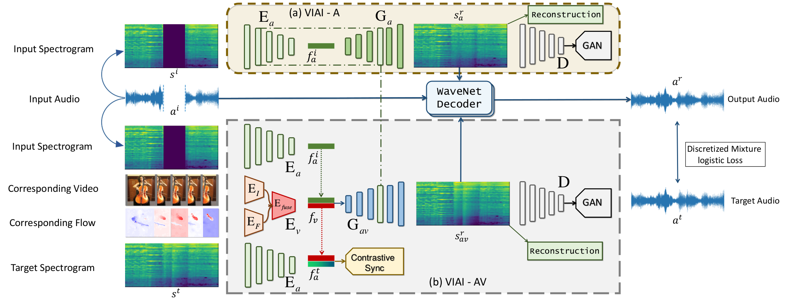

# Vision-Infused Deep Audio Inpainting

We present a vision-infused method that can deal with both audio-only and audio-visual associated inpainting Inspired by image inpainting, called `Vision-Infused Audio Inpainter (VIAI)`.

[[Project]](https://hangz-nju-cuhk.github.io/projects/AudioInpainting) [[Paper]](https://hangz-nju-cuhk.github.io/projects/audio-inpainting/Vision-Infused-Deep-Audio-Inpainting.pdf) [[Demo]](https://www.youtube.com/watch?v=2C8s_YuRRxk)



## Requirements
* [python 3](https://www.python.org/download/releases/3.6/)
* [PyTorch](https://pytorch.org/)（version >= 0.4.1)
* [opencv3](https://opencv.org/releases.html)

## Dataset

The MUSICES dataset can be accessed [here](https://hangz-nju-cuhk.github.io/projects/audio-inpainting/MUSICES.json).

## Training and Testing

We are still sorting out the code. For now it is not complete thus not runable, but the architecture is revealed.
Please wait for more details.


## License and Citation
The use of this software is RESTRICTED to **non-commercial research and educational purposes**.

```
@InProceedings{Zhou_2019_ICCV,
  author = {Zhou, Hang and Liu, Ziwei and Xu, Xudong and Luo, Ping and Wang, Xiaogang},
  title = {Vision-Infused Deep Audio Inpainting},
  booktitle = {The IEEE International Conference on Computer Vision (ICCV)},
  month = {October},
  year = {2019}
} 
```

## Acknowledgement
The structure of this codebase is borrowed from [pix2pix](https://github.com/junyanz/pytorch-CycleGAN-and-pix2pix) and [wavent_vocoder](https://github.com/r9y9/wavenet_vocoder).
